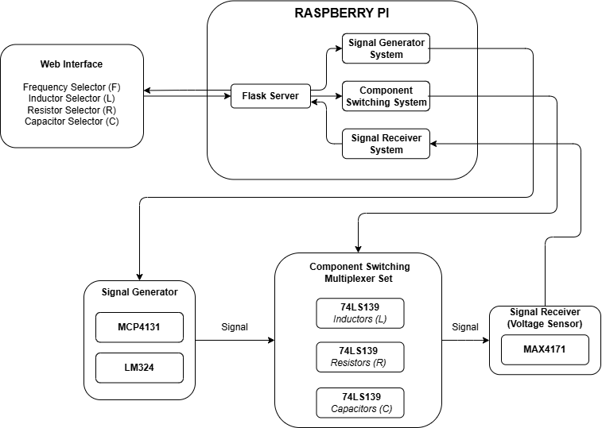
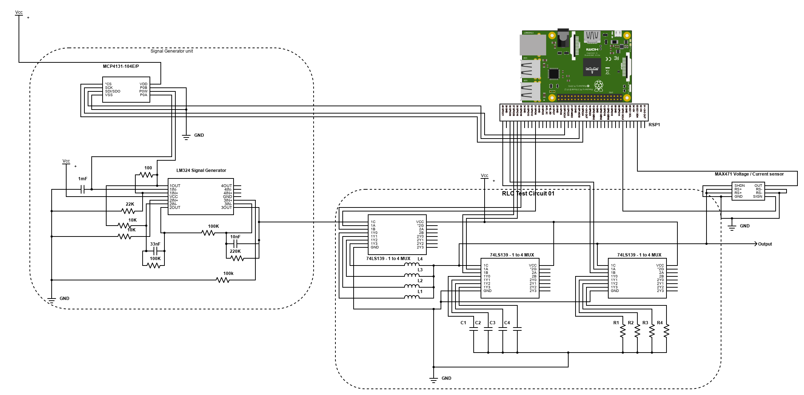

# IoT-Based Online Electronics Lab

## Overview

This project implements an IoT-based online electronics lab, allowing students to remotely conduct experiments using real electronic components controlled via a Raspberry Pi 4 server. A Flask web application provides a user interface to control the experiment parameters and visualize the results.

## Functionality

1.  **AC Signal Generation:**
    *   Students input desired frequency values through the web interface.
    *   The Raspberry Pi controls an LM324 operational amplifier to generate an AC signal.
    *   The frequency of the AC signal is adjusted using an MCP4131 digital potentiometer.

2.  **LRC Circuit:**
    *   The AC signal is passed through an LRC circuit (inductor, resistor, capacitor).
    *   The values of L, R, and C are selectable by the user via the web interface.
    *   Digital multiplexers (74LS139) are used to switch between different LRC configurations.

3.  **Signal Amplification:**
    *   The output signal from the LRC circuit is amplified using a MAX4171 amplifier.

4.  **Data Acquisition and Visualization:**
    *   An ADS1115 analog-to-digital converter (ADC) connected to the Raspberry Pi measures the amplified output signal.
    *   A Kalman filter is applied to the measured voltage readings to reduce noise.
    *   The filtered signal is plotted using Matplotlib.
    *   The plot is converted into an image and sent back to the web interface for visualization.

## System Architecture

[//]: # ()
*Replace this with a diagram of your entire system. A block diagram showing the flow of information from the web interface, through the Raspberry Pi, to the components, and back, would be ideal.*
***Add the image into the same directory where the README.md file is located and replace the `path/to/system_architecture.png` accordingly***

The system comprises the following key components:

*   **Web Interface (Flask):**  A Flask-based web application that provides a user interface for students to input experiment parameters (L, R, C values, frequency) and view the results.
*   **Raspberry Pi 4:** Acts as the server, controlling the electronic components based on user input and acquiring data from the ADC.
*   **MCP4131 Digital Potentiometer:** Controls the frequency of the AC signal generated by the LM324.
*   **74LS139 Digital Multiplexers:** Select the appropriate LRC component values based on user input.
*   **MAX4171 Amplifier:** Amplifies the output signal from the LRC circuit.
*   **ADS1115 ADC:** Converts the analog output signal to a digital signal that can be read by the Raspberry Pi.
*   **Electronic Components (LM324, R, L, C):** The actual electronic components used in the experiment.

## Hardware Requirements

*   Raspberry Pi 4
*   ADS1115 ADC
*   MCP4131 Digital Potentiometer
*   74LS139 Digital Multiplexers
*   MAX4171 Amplifier
*   LM324 Operational Amplifier
*   Resistors, Inductors, Capacitors (see LRC Values section below)
*   Breadboard, Jumper wires
*   Power supply

## Software Requirements

*   Python 3.7+
*   Flask
*   Adafruit ADS1x15 library
*   RPi.GPIO
*   spidev
*   Matplotlib
*   FilterPy
*   NumPy

## LRC Values

The following LRC values are available for selection through the web interface. The digital multiplexers are configured to switch between these values.

**Inductor Values:**

| Selection | Value    |
| --------- | -------- |
| L1        | 4.7 µH   |
| L2        | 10 µH    |
| L3        | 15 µH    |
| L4        | 100 µH   |

**Capacitor Values:**

| Selection | Value    |
| --------- | -------- |
| C1        | 0.33 µF  |
| C2        | 1 µF     |
| C3        | 3.3 µF   |
| C4        | 33 µF    |

**Resistor Values:**

| Selection | Value    |
| --------- | -------- |
| R1        | 2 kΩ     |
| R2        | 2.2 kΩ   |
| R3        | 22 kΩ    |
| R4        | 100 kΩ   |

## Installation and Setup

1.  **Clone the repository:**

    ```bash
    git clone [repository URL]
    cd [repository directory]
    ```

2.  **Install Python dependencies:**

    ```bash
    pip install -r requirements.txt
    ```

    *Create a `requirements.txt` file with the following:*

    ```
    Flask
    adafruit-ads1x15
    RPi.GPIO
    spidev
    matplotlib
    filterpy
    numpy
    ```

3.  **Enable SPI interface on Raspberry Pi:**

    *   Run `sudo raspi-config`.
    *   Select "Interface Options".
    *   Enable "SPI".
    *   Reboot the Raspberry Pi.

4.  **Connect the electronic components according to the circuit diagram.**  *Important: Double-check your wiring before powering on the system.*

    [//]: # ()

5.  **Run the Python scripts in separate terminals:**

    *   Terminal 1: `python only_ADS_kalman_wth_sliders.py`
    *   Terminal 2: `python only_switching.py`
    *   Terminal 3: `python only_MCP.py`

6.  **Run the Flask web application:**  *(Assuming you have a Flask app file, e.g., `app.py`)*

    ```bash
    python app.py
    ```

    *Detail the specifics of your Flask application setup here.  Include the port it runs on.*

## Usage

1.  Open a web browser and navigate to the address of the Flask web application (e.g., `http://<Raspberry Pi IP address>:5000`).
2.  Enter the desired values for L, R, and C (selecting from the values listed in the [LRC Values](#lrc-values) section), and frequency in the web interface.
3.  Click the "Run Experiment" button.
4.  The web interface will display the plot of the output signal.

## Code Structure

*   `only_ADS_kalman_wth_sliders.py`:  Reads analog voltage values from the ADS1115, applies a Kalman filter, and plots the filtered data.  Includes sliders to adjust Kalman filter parameters.
*   `only_switching.py`: Controls the digital multiplexers (74LS139) to switch between different LRC configurations based on the selected L, R, and C values.
*   `only_MCP.py`: Controls the MCP4131 digital potentiometer to adjust the frequency of the AC signal.
*   `app.py` (Example):  The Flask web application (you'll need to provide your actual Flask app file).  This file handles user input, communicates with the other Python scripts, and displays the results.
*   `requirements.txt`:  Lists the Python dependencies for the project.

## Troubleshooting

*   **No signal:** Check the wiring connections and power supply.
*   **Incorrect frequency:** Verify the MCP4131 settings and the LM324 circuit.
*   **Incorrect L, R, or C value:** Check the wiring to the 74LS139 multiplexers and verify that `only_switching.py` is correctly configured.
*   **Noisy signal:** Adjust the Kalman filter parameters (R and Q) using the sliders.
*   **Web application not running:** Ensure that Flask is installed correctly and that the `app.py` script is running without errors.
*   **SPI Communication Error**: Verify that SPI is enabled on your Raspberry Pi and the wiring to the MCP4131 is correct.

## Future Improvements

*   Implement error handling and input validation in the web interface.
*   Add support for different types of experiments.
*   Implement a more sophisticated control algorithm for the AC signal generation.
*   Develop a user authentication system to restrict access to the lab.
*   Create a graphical user interface for calibration of the ADS1115.
*   Improve the Kalman filtering by using a state-space model specifically tailored to the noise characteristics of the system.

## License

[Specify your license here, e.g., MIT License]

## Acknowledgements

*   [Acknowledge any libraries, tools, or individuals that contributed to the project.]
